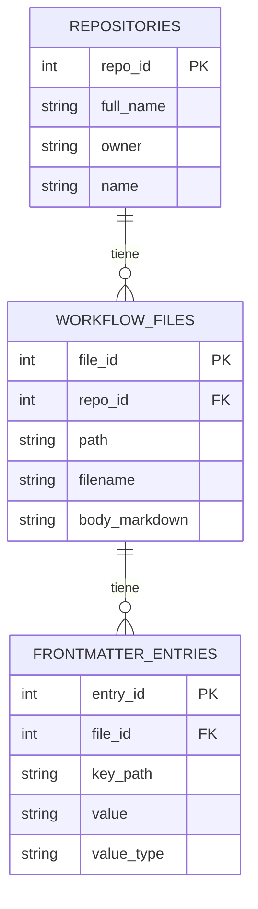

# Diagrama entidad-relación

Dataset generado por `miner dataset` a partir de los archivos `.md` de
GitHub Agentic Workflows (`.github/workflows/`) de los repositorios detectados
en la Tarea 2 (`repositorios_ghaw.csv`).

## Justificación del esquema

- **`repositories` (1) — `workflow_files` (N):** cada repositorio puede tener
  varios archivos `.md` de GH-AW en `.github/workflows/`; cada archivo
  pertenece exactamente a un repositorio (`workflow_files.repo_id` es FK hacia
  `repositories.repo_id`).
- **`workflow_files` (1) — `frontmatter_entries` (N):** cada archivo tiene un
  frontmatter YAML con cero o más claves; cada entrada del frontmatter
  pertenece exactamente a un archivo (`frontmatter_entries.file_id` es FK hacia
  `workflow_files.file_id`).
- **`frontmatter_entries` usa un modelo entidad-atributo-valor (EAV)** en vez
  de columnas fijas por clave de frontmatter, porque el frontmatter de GH-AW
  tiene esquema libre: cada workflow define las claves que necesita (`on`,
  `permissions`, `engine`, `tools`, `timeout_minutes`, claves anidadas, etc.) y
  esas claves varían de un archivo a otro. Las claves anidadas se aplanan con
  notación de punto (p. ej. `permissions.contents`); las listas se guardan
  serializadas como JSON en una sola fila (`value_type = "json"`).
- El **body en Markdown** de cada archivo se conserva íntegro en
  `workflow_files.body_markdown`, asociado a su archivo de origen.
